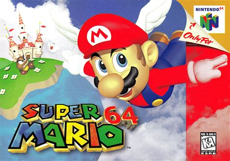

+++
date = '2026-09-30T09:22:42+05:00'
draft = false
title = 'My First Post'
summary = 'Small introduction to me and why I wanted to start writing a blog'
tags = ['introduction', 'personal', 'gaming', 'programming']
+++

# **Welcome**

Hello! Welcome to **Cached Memories**. This is my blog for, well, just messing around and writing my thoughts on stuff. My days are mostly consumed by going to my job from 9am to 6pm and then, with whatever time is left, I tend to read books or mangas. I also try to make maps (mostly fantasy world stuff). I like to play games (mostly Genshin Impact *(Trying to Get Vesna, My Pity is 54)* and Reverse 1999 *:p*). I enjoy learning programming as well as dabbling in some music making.

A quick introduction for me. The author! I have recently graduated from my university! I have gotten my bachelor's in Computer Science ***(I really really love computers)***. Like, a lot, my formative memories are of messing around on a Dell Pentium machine and playing old-era games like NES, SNES, GBA, Megadrive, and DS etc! For me, that was the greatest era of my life, just me and my computer so I could play my games. During that time, my favorite game was **Super Mario 64!!!**

This game was absolutely magical to me as a kid. I was a big Mario fan, okay! And this was my first game I actually got to finish!! Honestly, I would love to talk about it, but since it's an introductory post I need to stay on track! Also, I am a mega mega fan of Amphibia, The Owl House, Steven Universe, Gravity Falls, ATLA, and LoK!

So why is this blog called cachedthoughts? Well, it's simple. I named it cachedthoughts because these are my cached thoughts! It's mostly random thoughts about random stuff I am doing and random books I am reading or random projects I am doing, as well as an attempt to improve my English writing skills.

Anyways, thank you for reading my first post! Byeeeeeeeeee!

P.S. I love to play Avatar Legends: The Fighting Game. I main Kyoshi (Cause She's BADASS, I read the books on her!) and will main Toph (Just Cause *shrug* )
